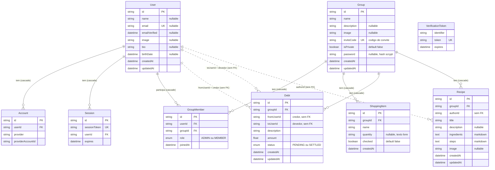

# Casa — Modelo de dados, contexto e registro de atualizações

Documento vivo. Fonte da verdade do schema: [prisma/schema.prisma](../prisma/schema.prisma). Visão geral do projeto,
comandos e convenções: [CLAUDE.md](../CLAUDE.md).

**Como manter:** mudou o schema → atualize as seções 1–3. Mudou comportamento, rota ou permissão → seção 4/5.
Tomou uma decisão → seção 6. Achou/corrigiu um problema → seção 7. **Sempre** acrescente uma linha datada no topo
da seção 8 (mais recente primeiro).

Estado documentado: `main` em 2026-09-21, já incluindo o balanço de débitos · última revisão deste documento:
2026-09-21.

---

## 1. Diagrama ER

Legenda: linha contínua = relação com FK e `onDelete: Cascade` no banco; linha **pontilhada** = relação *lógica*
sem FK (a coluna é só uma `String`, o banco não garante integridade). O diagrama mostra as colunas principais;
o dicionário completo está na seção 2.

`Account`, `Session` e `VerificationToken` são as tabelas exigidas pelo `@next-auth/prisma-adapter`. Como a sessão
usa **JWT**, `Session` nunca é escrita e `VerificationToken` só serviria para login por e-mail (não usado).

---

## 2. Dicionário de dados

Tipos Prisma. `?` = opcional (nullable). `cuid()` gera os ids.

### User
| Campo | Tipo | Notas |
|---|---|---|
| id | String @id | cuid; é o `token.sub` do JWT → `session.user.id` |
| name, image | String? | vêm do Google no primeiro login |
| email | String? @unique | |
| emailVerified | DateTime? | NextAuth |
| bio | String? | editável no perfil |
| birthDate | DateTime? | gravada como `YYYY-MM-DDT12:00:00Z` (meio-dia UTC, evita virar o dia por fuso); lida/exibida em UTC |
| createdAt / updatedAt | DateTime | |

### Group ("casa")
| Campo | Tipo | Notas |
|---|---|---|
| id | String @id | |
| name | String | obrigatório |
| description, image | String? | image = URL do Cloudinary |
| inviteCode | String @unique | `#` + 4 dígitos (1000–9999), gerado aleatoriamente com até 10 tentativas |
| isPrivate | Boolean = false | privada → exige senha para entrar |
| password | String? | `salt:hash` (scrypt, salt 16 B hex, hash 64 B hex); só preenchida se `isPrivate`. Regra: ≥ 6 caracteres e ≥ 1 número |
| createdAt / updatedAt | DateTime | |

### GroupMember
| Campo | Tipo | Notas |
|---|---|---|
| id | String @id | |
| userId → User, groupId → Group | String | FKs com cascade |
| role | GroupMemberRole = MEMBER | `ADMIN` \| `MEMBER` |
| joinedAt | DateTime | ordena a lista de casas do usuário |
| — | `@@unique([userId, groupId])` | chave usada em todo o código: `userId_groupId` |

### ShoppingItem
`id`, `name`, `quantity String?` (texto livre, ex. "2kg"), `checked Boolean = false`, `createdAt`,
`groupId → Group` (cascade). Não guarda quem adicionou nem quem marcou.

### Debt
| Campo | Tipo | Notas |
|---|---|---|
| id | String @id | |
| description | String | |
| amount | Float | **valor da cota de UMA pessoa**, não o total da conta |
| status | DebtStatus = PENDING | `PENDING` \| `SETTLED` (só transita PENDING → SETTLED) |
| fromUserId | String | **credor** (quem criou o débito / a quem devem). Sem FK |
| toUserId | String | **devedor**. Sem FK |
| groupId → Group | String | cascade |
| createdAt / updatedAt | DateTime | |

### Recipe
`id`, `title`, `description String?`, `ingredients @db.Text` e `steps @db.Text` (ambos **Markdown**, renderizados com
react-markdown + remark-gfm, sem HTML bruto), `image String?` (coluna e API existem, **a UI não envia**),
`authorId String` (sem FK), `groupId → Group` (cascade), `createdAt`, `updatedAt`.

### Account / Session / VerificationToken
Padrão do NextAuth. `Account`: `@@unique([provider, providerAccountId])`, cascade em `User`. `Session`: cascade em
`User`. `VerificationToken`: `@@unique([identifier, token])`.

---

## 3. Integridade e regras de negócio

**Cascatas (banco):** apagar `User` → apaga `Account`, `Session`, `GroupMember`. Apagar `Group` → apaga
`GroupMember`, `ShoppingItem`, `Debt`, `Recipe`. Nenhum fluxo do app apaga `User`.

**Sem cascata (lógico):** `Debt.fromUserId/toUserId` e `Recipe.authorId` não são FK. Quando um morador sai ou é
removido, seus débitos pendentes e receitas **permanecem** apontando para um usuário que não é mais membro (a UI cai
no nome "Alguém"; a receita órfã só pode ser apagada pelo autor, que precisa ser membro — ou seja, ninguém
consegue apagá-la enquanto ele não voltar).

**Índices:** apenas PKs e `@unique`. Não há `@@index([groupId])` em `ShoppingItem`, `Debt`, `Recipe` nem em
`GroupMember` (o unique composto começa por `userId`).

**Ciclo de vida de uma casa**
1. Criar: o criador vira `ADMIN` (único admin; não existe rota para promover/transferir).
2. Entrar (`POST /api/groups/join`): normaliza o código para `#NNNN`; 404 se inexistente; 409 se já é membro; se
   privada e sem senha → `{requiresPassword: true, groupName}` (status 200, fase 1); com senha → confere com
   `timingSafeEqual` (401 se errada); cria `GroupMember(MEMBER)`.
3. Sair/remover (`DELETE …/members`): membro pode sair; ADMIN pode remover qualquer outro; ADMIN **não** pode sair
   enquanto houver outros moradores (400); ADMIN sozinho que "sai" **apaga a casa**.
4. Excluir (`DELETE /api/groups/[id]`): só ADMIN; cascade apaga tudo.

**Como um débito é criado (lado cliente, `DebtsCard`):** o usuário informa o valor total e marca os
participantes; opcionalmente inclui a si mesmo. `cota = total / (devedores selecionados + (eu incluído ? 1 : 0))`.
Para **cada** devedor faz um `POST` separado com `amount = cota`, `toUserId = devedor`; o servidor grava
`fromUserId = usuário logado`. Não é atômico (falha parcial cria só alguns).
Na UI: `toUserId === eu` → "Você deve R$ X a {fromUser}"; `fromUserId === eu` → "{toUser} deve R$ X a você".
A lista só mostra débitos em que o usuário é parte, **mas o servidor entrega todos os débitos PENDING da casa** ao
navegador de qualquer membro.

**Balanço por pessoa (aba "Balanço" do card de Débitos):** `computeBalances` (`src/lib/debts.ts`) soma, para o usuário
logado, os débitos PENDING com cada morador em **centavos inteiros** (`Math.round(amount * 100)`): `fromUserId = eu` →
a pessoa me deve (+); `toUserId = eu` → eu devo (−). Débitos de que o usuário não faz parte e auto-débitos são
ignorados. Saldo 0 com débitos nos dois sentidos aparece como "quites" e ainda pode ser quitado. Quem não é mais
membro aparece como "Alguém" (e pode ser quitado — é a saída para débitos órfãos).
**Quitar tudo com uma pessoa** = `PATCH …/debts { debtIds }` com **todos** os débitos entre os dois, nos dois sentidos
(acerto de contas: o saldo líquido é dado como pago por fora). O cliente envia os ids que o usuário viu na
confirmação; o servidor só quita os que são PENDING, da casa da URL e em que o usuário é parte. Não há desfazer.

### Matriz de permissões (estado atual)

| Ação | API exige | UI restringe a |
|---|---|---|
| Ver casa, listas, membros | membro | membro |
| Editar nome/descrição/imagem da casa | ADMIN | ADMIN |
| Excluir casa | ADMIN | ADMIN |
| Remover outro morador | ADMIN | ADMIN (X no hover) |
| Sair da casa | membro (ADMIN só se for o último) | não-admin vê "Sair da casa" |
| Compras: adicionar / marcar / remover | membro | membro |
| Débito: criar | membro | membro |
| Débito: quitar (`{debtId}`) | membro (**qualquer um**) | só quem é parte no débito |
| Débito: quitar em lote (`{debtIds}`) | membro; só débitos PENDING da casa em que é parte | botão "Quitar" por pessoa, com confirmação |
| Receita: criar | membro | membro |
| Receita: remover | autor | autor |
| Alterar privacidade/senha da casa | — não existe | — |

---

## 4. Contexto atual do produto

**Funcionando:** login Google · dashboard com casas do usuário · criar casa (foto, descrição, pública/privada com
senha) · entrar por código (com fase de senha) · editar/excluir casa (admin) · gerenciar moradores (remover/sair) ·
lista de compras (adicionar, marcar como comprado, remover) · débitos com divisão igual entre participantes ·
**balanço líquido por pessoa** (aba Balanço, padrão do card) com **"Quitar tudo" por pessoa** e confirmação em modal ·
receitas em Markdown (ingredientes e preparo) · perfil (nome, bio, data de nascimento) · upload de imagem
(casa) · layout responsivo com subpáginas no mobile · skeletons de carregamento (`dashboard/loading.tsx`,
`grupos/[id]/loading.tsx`) · 404 customizada.

**Não existe (ainda):** tempo real/polling · testes · migrações versionadas · promover/transferir admin · alterar
privacidade/senha/código da casa · foto em receitas · persistir troca de foto do perfil (ver seção 7) · editar
item de compra, débito ou receita · desfazer quitação · histórico de débitos quitados (só PENDING é carregado) ·
notificações · rate limiting.

**Infra:** Vercel (`vercel.json`: `npx prisma generate && next build`) · Neon PostgreSQL (`DATABASE_URL` +
`DIRECT_URL`) · Cloudinary com upload *unsigned* (pasta `casa-app`) · Google OAuth. README.md é público/de marketing;
ele afirma "tempo real" e "foto em receitas/perfil", o que o código **não** entrega hoje.

---

## 5. Superfície da API (resumo)

Tabela completa em [CLAUDE.md](../CLAUDE.md#api). Não há `GET` para shopping/debts/recipes: esses dados chegam
pelo `include` do server component (`GroupPage`) ou por `GET /api/groups/[id]`, que carrega `members(+user)`,
`shoppingItems`, `debts` (só `PENDING`) e `recipes`.

---

## 6. Decisões

Formato: **decisão** — motivo/consequência. (Motivos marcados *inferido* vêm da leitura do código, não de registro
do autor; confirme com o dono do projeto e corrija aqui.)

- **Next.js App Router + Prisma + Postgres (Neon) + Vercel.** Stack única serverless. O schema declara `url` (`DATABASE_URL`) e
  `directUrl` (`DIRECT_URL`) — padrão Prisma + Neon: pooler no runtime, conexão direta para `db push`/migrate.
  *(inferido)*
- **Login somente Google (NextAuth, sessão JWT, PrismaAdapter).** Sem senhas de usuário. JWT evita consulta ao banco
  a cada request; o adapter continua criando `User`/`Account`. `session.user.id` é injetado a partir de `token.sub`.
- **Middleware protege `/dashboard` e `/grupos`**, e cada página/rota valida sessão e associação de novo (defesa em
  profundidade). A autorização é feita por rota, não por camada central.
- **Autorização por associação:** a chave composta `userId_groupId` de `GroupMember` é o único critério de acesso a
  qualquer dado da casa; papel `ADMIN` só para editar/excluir a casa e remover moradores.
- **Casa privada = senha própria da casa** (scrypt com salt, comparação em tempo constante), separada do código de
  convite `#NNNN`. Entrada em duas fases para só pedir senha quando necessário.
- **`Debt.amount` = cota individual**, com `fromUserId` = credor e `toUserId` = devedor (nomes na direção "quem
  recebe → quem paga"). Um registro por devedor, sem entidade "conta/grupo de despesa". Simples, mas não permite
  reconstruir o total original nem ligar débitos da mesma conta. *(inferido)*
- **`Debt.fromUserId/toUserId` e `Recipe.authorId` sem relação Prisma** — evita cascatas/joins; custo: nada impede
  ids inválidos nem limpa dados órfãos. *(inferido)*
- **Balanço por pessoa calculado no cliente, em centavos inteiros; quitação em lote nos dois sentidos, por ids.**
  Sem mudança de schema. Somar `Float` direto acumula ruído (0,1 + 0,2), então converte-se cada débito com
  `Math.round(amount*100)`. "Quitar tudo" zera o par (acerto de contas) em vez de só o que EU devo; a confirmação
  mostra o saldo líquido para deixar claro o que é dado como pago. O cliente envia os `debtIds` que o usuário viu
  (o que se vê é o que se quita): um débito novo criado por outro morador depois do carregamento não é quitado sem
  ser visto, e o ramo já valida grupo + parte. Sem botão "quitar com todos" (um toque afetaria várias pessoas).
- **Ingredientes e preparo em Markdown**, renderizados por `react-markdown` + `remark-gfm` sem HTML bruto (seguro
  contra XSS) e com componentes estilizados no tema.
- **Upload via Cloudinary *unsigned* pela nossa rota `/api/upload`** (exige sessão, valida `image/*` e 5 MB) — sem
  guardar arquivos na Vercel. O banco guarda apenas a URL.
- **Layout responsivo por navegação:** `<1024px` → subpáginas; `≥1024px` → modal. `useIsDesktop` (pointer: fine)
  desliga `autoFocus` em touch para não abrir o teclado.
- **Sem tempo real:** estado local do cliente após o SSR inicial; simplicidade acima de sincronização. *(inferido)*
- **ESLint mínimo (`next/core-web-vitals`)** — a regra `@typescript-eslint/no-unused-vars` foi removida porque
  quebrou o build da Vercel (`58f6797`).
- **`prisma/migrations/` no `.gitignore`; schema aplicado com `db push`.** Rápido para prototipar; sem histórico
  reversível — reavaliar antes de ter dados de produção que importem. *(inferido)*
- **Identidade visual:** paleta creme/verde-floresta/terra, Fraunces + Plus Jakarta Sans (ver CLAUDE.md).

---

## 7. Problemas conhecidos e pendências

Levantados na leitura do código em 2026-09-21 (nenhum foi corrigido ainda). Prioridade sugerida: A alta, B média,
C baixa.

### Segurança / autorização
- **A — IDOR em shopping e debts:** `PATCH/DELETE …/shopping` e `PATCH …/debts` só conferem que o usuário é membro
  da casa da URL; `itemId`/`debtId` **não** são verificados contra `params.id`. Um membro de qualquer casa que
  conheça um id altera item/débito de outra casa (cuids não são adivinháveis, mas a checagem deve existir).
  `recipes` DELETE já faz certo (`recipe.groupId !== params.id`).
- **A — Quitar débito (`{debtId}`):** qualquer membro pode quitar qualquer débito via API; a UI só mostra o botão às
  partes. (O ramo em lote `{debtIds}`, criado em 2026-09-21, já restringe a casa da URL + partes.)
- **C — ✓ individual de quitar** (aba Débitos) só aparece no hover: no celular fica invisível porém tocável, dá para
  quitar sem querer e sem confirmação. Deixado de fora do balanço por decisão do usuário.
- **B — Hash de senha da casa vaza para o cliente:** `Group.password` é retornado por `GET` e
  `POST /api/groups`, `GET /api/groups/[id]`, `POST /api/groups/join` e serializado nas props de
  `DashboardClient`/`GroupClient` (páginas passam o objeto inteiro). Usar `select`/omit. Impacto: o hash de uma
  senha que o criador pode reutilizar fica exposto a todos os moradores (quebra offline).
- **B — `POST /api/groups/[id]/debts` não valida** que `toUserId` é membro da casa, nem `amount` finito e `> 0`.
- **B — Sem rate limit** em `join` (código de 4 dígitos ≈ 9 000 combinações enumeráveis; senha de casa privada sem
  bloqueio) e em `upload`.
- **B — `debug: true` fixo** em `src/lib/auth.ts` (logs verbosos do NextAuth em produção). Condicionar a `NODE_ENV`.
- **B — Débitos de todos os moradores** são enviados ao navegador de cada membro (a UI só filtra).
- **C — Upload:** valida `file.type` (informado pelo cliente) e não o conteúdo; preset unsigned sem limite por usuário.
- **C — `PATCH /api/groups/[id]`:** `body.name.trim()` lança se não for string (500) e aceita nome vazio.
- **C — `DELETE …/members`:** alvo que não é membro gera erro do Prisma (500) em vez de 404; corpo ausente idem.
- **C — `.claude/settings.local.json`** está versionado apesar do nome "local"; avaliar `.gitignore`.

### Bugs / dados
- **A — Foto de perfil não persiste:** `ProfilePanel` permite trocar a foto (upload ok, prévia ok), mas `handleSave`
  envia só `{name, bio, birthDate}` e `PATCH /api/user` ignora `image`. Ao fechar, a foto volta ao valor do Google.
- **B — `inviteCode`:** após 10 colisões o laço sai com um código repetido → violação de unique (500). Improvável
  hoje, cresce com o nº de casas (espaço de só 9 000 códigos).
- **B — `Debt.amount` como `Float`** para dinheiro; a divisão (ex.: 10 ÷ 3) não fecha centavos (3 cotas de 3,33 = 9,99).
  Preferir `Decimal` ou centavos inteiros e definir regra de arredondamento. (O balanço já soma em centavos, o que evita
  ruído de Float na exibição, mas não recupera o centavo perdido na divisão.)
- **B — Criação de débito não atômica** (N `POST`s sequenciais); falha parcial deixa débitos incompletos e a UI fecha
  o modal se ao menos um passar. Criar endpoint em lote com transação.
- **B — Órfãos ao sair da casa:** débitos pendentes e receitas de quem saiu permanecem (ver seção 3).
- **C — Índices ausentes** em `groupId` (ver seção 3) — relevante só com volume.

### Produto / código
- README diz "tempo real" e "foto" em receitas/perfil; código não entrega (seção 4).
- Só existe 1 ADMIN por casa, sem transferência; ADMIN não consegue sair sem apagar tudo ou expulsar todos.
- Duplicação: `assertMember` repetido em 3 rotas; tipos (`Member`, `Debt`, `Recipe`, `ShoppingItem`) redeclarados em
  vários componentes; `GroupClient`, `DebtsCard`, `Dashboard*` são grandes. Candidatos a `src/lib` / `src/types`.
- Sem testes automatizados.

---

## 8. Registro de atualizações

Mais recente primeiro. Formato: `AAAA-MM-DD — [commit] resumo`.

- **2026-09-21** — *(fix/ui)* Cards de Compras, Débitos (as duas abas) e Receitas: barra de rolagem afastada dos
  itens (`pr-2 -mr-2` no contêiner rolável), mantendo os três cards iguais lado a lado no desktop.
- **2026-09-21** — *(feat)* **Balanço por pessoa + "Quitar tudo" no card de Débitos.** Aba
  "Balanço" (padrão) / "Débitos"; resumo A receber / A pagar; uma linha por morador com saldo líquido e botão "Quitar",
  que abre confirmação em modal (mostra nº de débitos e saldo; bloqueia toque duplo). `PATCH …/debts` agora aceita
  `{ debtIds }` (quitação em lote, só PENDING da casa em que o usuário é parte). Novos: `src/lib/debts.ts`,
  `DebtBalances.tsx`, `MiniAvatar.tsx` (extraído de `DebtsCard`). Sem mudança de schema. Verificado: `tsc`, `lint`,
  testes descartáveis de `computeBalances` e render SSR; **não** testado em navegador nem contra o banco.
- **2026-09-21** — *(docs)* Criados `CLAUDE.md` e `docs/ER.md` a partir de uma leitura completa do
  repositório. Registrados: diagrama ER, dicionário de dados, permissões, decisões e lista de problemas conhecidos
  (nenhum código de aplicação foi alterado).
- **2026-03-27 — `f3e8982`** — *feat: gestão de moradores e ajustes de UI.* Nova rota `DELETE /api/groups/[id]/members`
  (admin remove, membro sai, último admin apaga a casa) e `DELETE /api/groups/[id]`; `GroupClient` ganhou modal
  "Editar casa" com zona de perigo (excluir), botão de sair e remoção de morador; `MembersBar` reescrita (coroa de
  admin, X no hover, "Sair da casa"); `UserMenu` inline com `z-50`. (A mensagem do commit também cita receitas em
  Markdown e favicon, mas esses arquivos já constavam no primeiro commit.)
- **2026-03-27 — `58f6797`** — *fix:* `.eslintrc.json` reduzido a `next/core-web-vitals` (regra do
  `typescript-eslint` não estava disponível no build).
- **2026-03-27 — `f6f16f1`** — *first commit.* Base completa: Next.js 14 + Prisma + NextAuth (Google), casas
  públicas/privadas com convite `#NNNN`, lista de compras, débitos, receitas (Markdown), perfil, upload Cloudinary,
  skeletons, 404, design system Tailwind, deploy Vercel.
